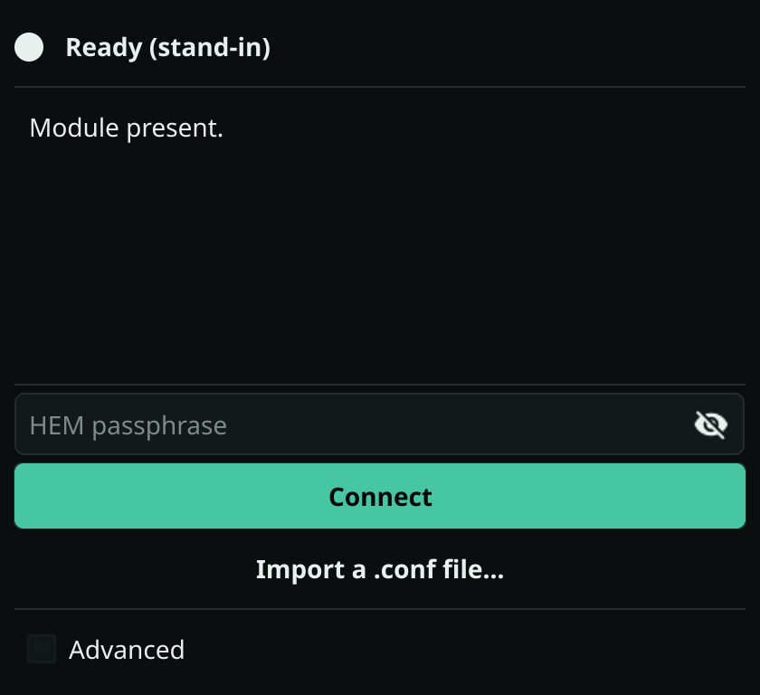
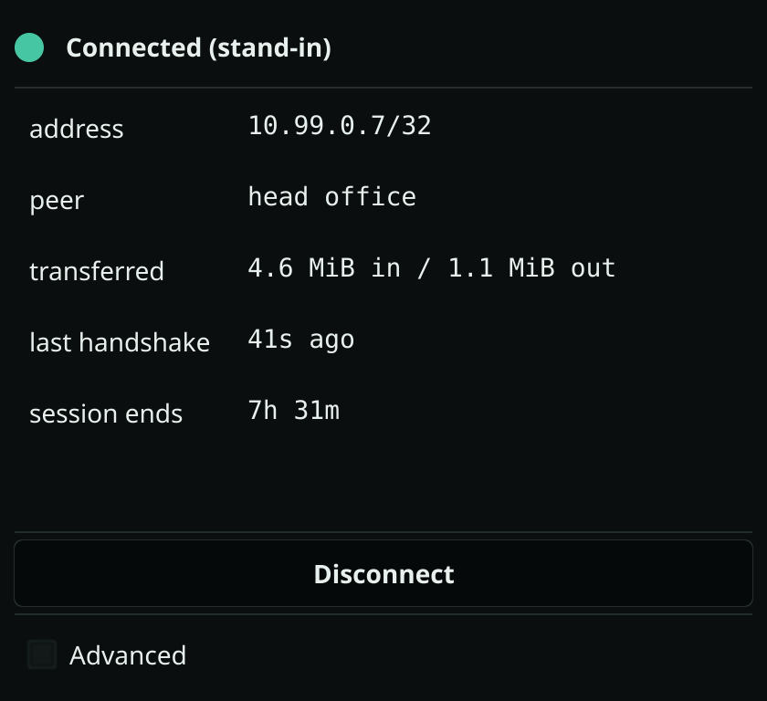
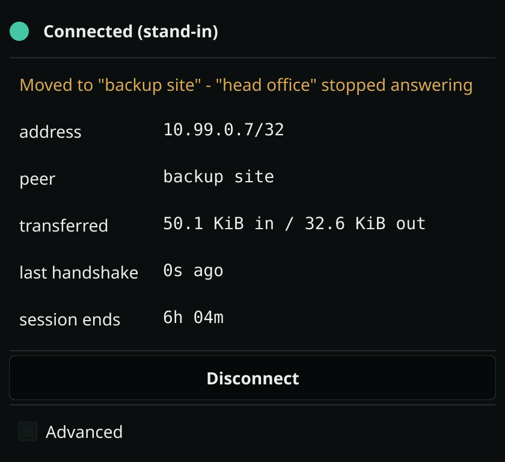

# Encedo WG

[](https://github.com/encedo/encedo-wg-hsm/actions/workflows/ci.yml)

**Version 0.9.1** · MIT

WireGuard with the private key in hardware. The key is generated inside an
**Encedo HEM** — Hardware Encryption Module — and **never leaves it**. Every
Curve25519 operation that needs the static private key is delegated to the module
at runtime, on every handshake.

There is no `PrivateKey` line to protect, because there is no private key on the
machine. The configuration holds opaque key identifiers and nothing else, so it
is safe in git, in a CMDB, or in any backup.

The far end needs to know none of this. Both clients have been tested against a
stock kernel WireGuard server running unmodified `wireguard-tools` from the
distribution — it sees an ordinary peer.

<p align="center">
  
  
  
</p>

<p align="center"><sub>Rendered from the interface's own test harness, which is
why each one says <em>stand-in</em>: the window marks a scripted session so it
cannot be mistaken for a tunnel.</sub></p>

## Install in three steps

**Windows.** Download `encedo-wg-<arch>.msi` from the
[releases page](https://github.com/encedo/encedo-wg-hsm/releases), run it, plug
in the module. The installer places the window, the privileged service and
`wintun.dll` together, which is where they have to be.

**Linux.** Download the `.deb` from the same page and install it, plug in the
module, and start `encedo-wg` from the desktop menu. The package brings the
service, the tmpfiles entry and the polkit rule that lets the tunnel set DNS.

```bash
sudo apt install ./encedo-wg_<version>_<arch>.deb
```

Packages are built for both `amd64` and `arm64`.

**Either, from a file you already have.** If there is an ordinary WireGuard
configuration on the machine, bring it across — the private key in it is
discarded rather than imported, and a new identity is generated inside the
module:

```bash
wg-hem import ~/Downloads/wg0.conf
```

It prints the new public key and address. Hand those to whoever runs the server;
that one line is the whole migration.

Full instructions, including building from source and running without root:
**[docs/INSTALL.md](docs/INSTALL.md)**.

## Two clients, and a window

They differ in where the configuration lives, not in how the key is protected.

| | `wg-quick-encedo` | `wg-hem` |
|---|---|---|
| Configuration | `wg1.conf`, keys replaced by HEM key ids | in the HEM, under a MAC computed inside the device |
| On disk | one file | nothing |
| Peer selection | the config file | failover across stored peers |
| Tampering with routes | possible, undetected | detectable — the MAC covers addresses, routes and DNS |

`wg-quick-encedo` is the smaller step from a standard WireGuard deployment: the
file you already have, with `PrivateKey` gone. `wg-hem` removes the file
entirely — addresses, peers, routes, DNS and MTU live in the module beside the
keys, under a single MAC computed inside the device, so altering the routing is
detectable rather than merely unprofitable. Both share the same handshake path
and the same failure behaviour.

The window drives `wg-hem`. It talks to a privileged component over a local
socket — systemd and `cap_net_admin` on Linux, a service running as LocalSystem
behind a named pipe on Windows — so the tunnel is created with privileges the
window itself never holds.

## Where it runs

| | Linux | Windows | macOS |
|---|---|---|---|
| Command line | tested against real hardware | tested against real hardware | built, never run against a module |
| Window | tested against real hardware | tested against real hardware | not yet |
| Package | `.deb` | MSI and a bundle | not yet |

Windows binaries are **not signed yet** — the signing path is written and waits
on identity validation, so Defender may quarantine them until it completes.
Full-tunnel routing (`AllowedIPs = 0.0.0.0/0`) is implemented and has never
carried a live tunnel. This page will say so until it has.

## Documentation

- **[docs/INSTALL.md](docs/INSTALL.md)** — download or build, and set up each platform
- **[docs/USAGE.md](docs/USAGE.md)** — both clients, command by command, with a worked example
- **[docs/ARCHITECTURE.md](docs/ARCHITECTURE.md)** — where the key stays, what is patched, and why the module must stay online
- **[docs/ARCHITECTURE-GUI.md](docs/ARCHITECTURE-GUI.md)** — the window and the privileged component
- **[docs/WINDOWS.md](docs/WINDOWS.md)** — the service, the named pipe, and what each test settled
- **[docs/ENCEDO-WG-CONFIGFREE-SPEC.md](docs/ENCEDO-WG-CONFIGFREE-SPEC.md)** — specification for the config-free client
- **[docs/RELEASING.md](docs/RELEASING.md)** — build, sign, package, in that order
- **[UPSTREAM.md](UPSTREAM.md)** — the wireguard-go relationship and how to raise the pin
- **[TODO.md](TODO.md)** — what is left, and why each item is where it is

## Licence

MIT. This work derives from [wireguard-go](https://git.zx2c4.com/wireguard-go/);
`wireguard-go/` and `dist/` are not stored here. `build.sh` clones upstream at a
pinned commit and applies a 49-line patch rather than keeping copies of
upstream's files — see [UPSTREAM.md](UPSTREAM.md), which is what makes a version
bump fail loudly instead of silently discarding upstream changes to the
handshake.

"WireGuard" is a registered trademark of Jason A. Donenfeld. This project is not
affiliated with or endorsed by the WireGuard project.
